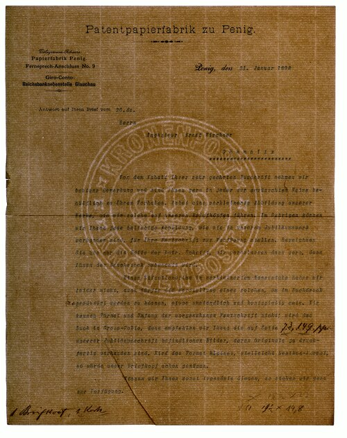
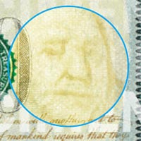
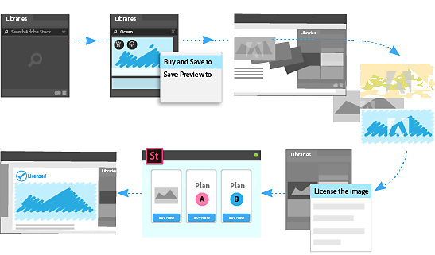
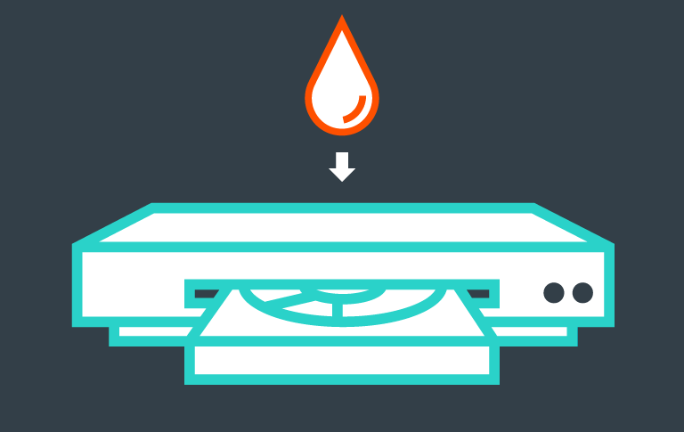
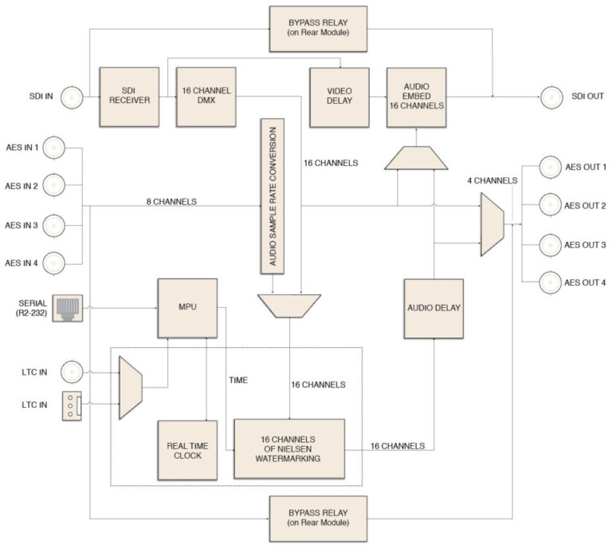
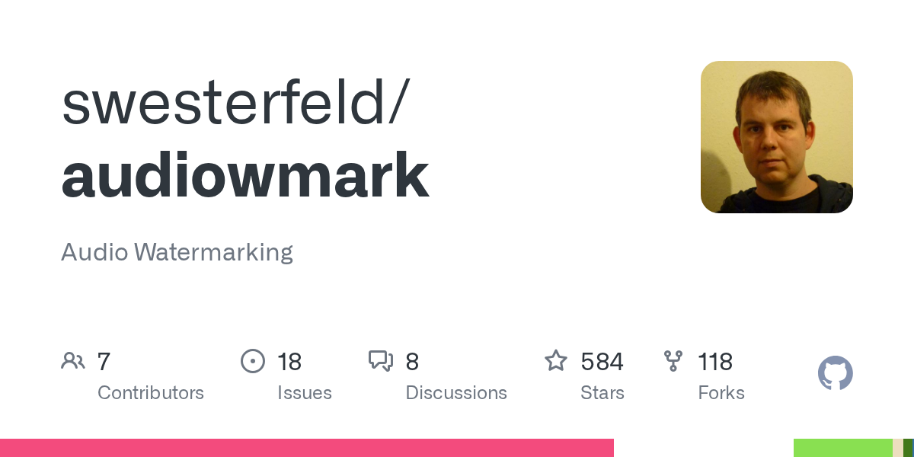
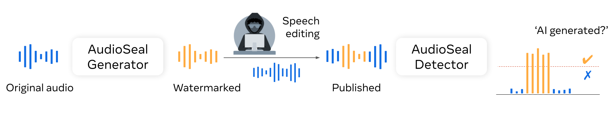
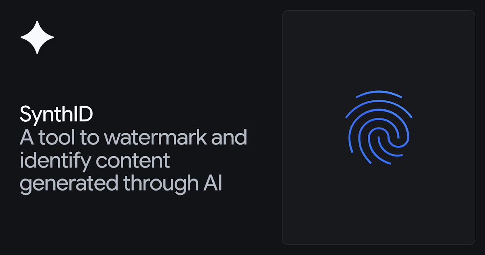
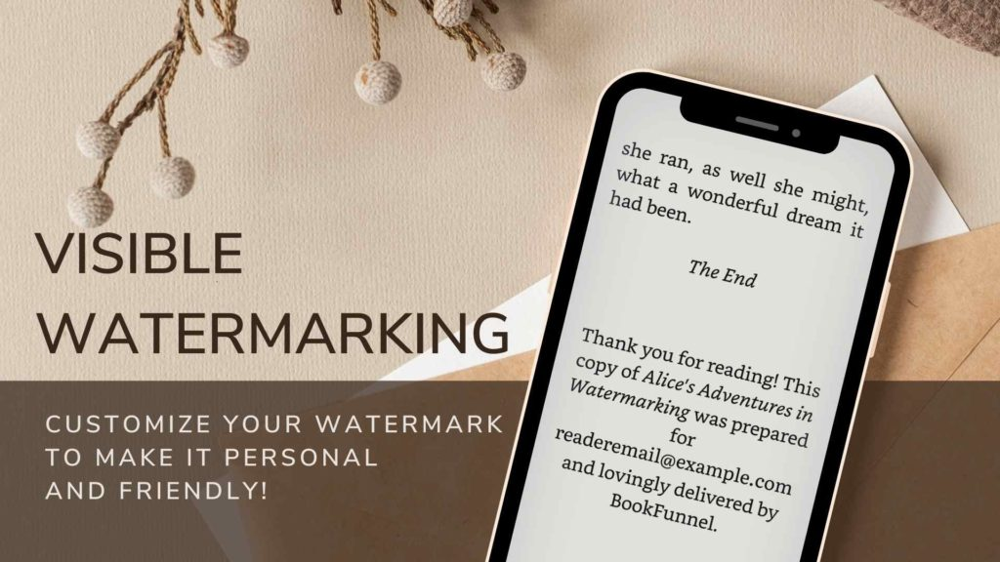
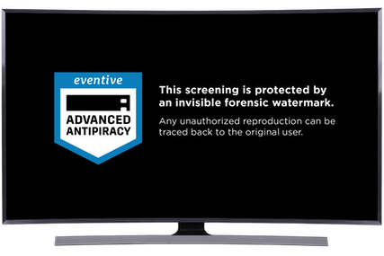

+++
slug = "spymarks"
title = "Spymarks, not Watermarks"
description = "Encoded unique IDs are more spy tool than anything else"
tags = ["Privacy", "AI", "Technology"]
draft = true
+++

We need a new word to describe today's sneaky new evolution of "watermarks":

<div class="spymark-intro">

```embed
src = "spymark-title.ts"
title = "Spymark"
height = 410
fallback = "“Spymark”"
```

</div>

A **watermark** is a mark embedded in paper or media to assert ownership, identify an official source, or verify authenticity. It typically denotes a third party authority. It's a cute little term.

A **spymark**, by contrast, is a hidden signal that forces your work disclose its origin, tools, or distribution history without meaningful control by you. It can map directly back to you, often without your knowledge.

## We need a new word for this

Unless you're an uber-nerd like me, most ordinary people tire and zone out of the discourse on privacy. It's technical, it's boring. Imagined future horrors and slippery slopes are often called comedic hyperbole.

Articulating this discussion requires a lot of shared context, and we can't keep having this front-loaded conversation over and over and expect people to pay attention.

> "To speak the name is to control the thing." &mdash; Ursula K. Le Guin

By creating a new word that captures the argument in two syllables, you collapse a salient and gain territory. You no longer have to waste energy establishing the basic facts.

Ergo,

- *Spy*- &mdash; clandestine signal, not attached as standard metadata

- -*mark* &mdash; already shared with watermark in both use and etymology.

Everything we have to say is immediately obvious. This is our *Rumpelstiltskin*.


## Spymarking sneaks into your files

Meanwhile, an audio signal spymark is sneaky and doesn't necessarily announce its presence,

```embed
src = "audio-watermarks.ts"
title = "Audio watermark spectrograms"
height = 450
fallback = "Compare spectrograms of the same LJ Speech excerpt unwatermarked and with Timbre, AudioSeal, WavMark, FSVC, Patchwork, or Norm-Space. The authors’ original plots are linked below."
```

<small>Spectrograms from Wen et al. (2025), <a href="https://arxiv.org/abs/2503.19176">SoK: How Robust is Audio Watermarking in Generative AI models?</a> · <a href="https://sokaudiowm.github.io/">Original samples</a>. Plots retain the authors’ original scales.</small>

The user cannot see or hear such a spymark. Nor do they have any idea what the payload contains.

## Image overlays: Not spymarks

It's pretty clear that the following image has a watermark:

<figure style="max-width: 481px; margin-inline: auto;">
  <a href="https://commons.wikimedia.org/wiki/File:DorotheaGetty.webp"></a>
  <figcaption><small>Dorothea Lange, <cite>Migrant Mother</cite> (1936) · Public domain in the U.S. · <a href="https://commons.wikimedia.org/wiki/File:DorotheaGetty.webp">Wikimedia Commons</a> · <a href="https://www.gettyimages.com/photos/migrant-mother-by-dorothea-lange">Getty Images listings</a>.</small></figcaption>
</figure>

The presence of a watermark isn't always foolproof. Getty doesn't own this image &mdash; it's public domain.

## Standardized, user-editable tags are not Spymarks

Just adding an invisible digital signal to a file does not mean it's a spymark. The ID3 tags on MP3s are technically "invisible" to users, yet their inclusion is standardized, easy to edit, and almost universally accessible. You can even read them in the raw file &mdash; they don't try to hide from you, and you can easily scrub them if you want.

```embed
src = "id3-hex.ts"
title = "ID3 tags in hex"
height = 520
fallback = "MP3 metadata can be stored in an ID3 tag. The bytes 49 44 33 spell ID3; TIT2, TPE1, and TALB identify the title, artist, and album frames. With JavaScript enabled, edit the sample values and inspect their bytes."
```

We need to be careful though: spymarks such as Google SynthID purport to be a "standard". Yet they does not limit what parties can encode to track users, nor does the spymark even announce to users its presence. Users have no idea and no control over what identifying data the payload contains.


## Same word, different jobs

“Spymark” is my proposed category. These labels describe the use: what the mark reveals and who controls it. Click an image to enlarge it.

<div class="watermark-examples">

| Item | Type | Description |
| --- | --- | --- |
| **[Traditional paper watermarks](https://en.wikipedia.org/wiki/Watermark)** <a class="example-image" href="media/paper-watermark.jpg" aria-label="Enlarge: Traditional paper watermarks"></a><small class="example-credit">Paper watermark<br><a href="https://commons.wikimedia.org/wiki/File:Patentpapierfabrik_zu_Penig,_Maschinen-Wasserzeichen_KRONENPOST_1898.tif">Commons · public domain</a></small> | **Watermark** | Designs formed through variations in paper thickness or density, often revealed by holding the sheet to light. Historically used to identify paper mills, paper quality, and manufacturing origins; they also help researchers date documents. Generally identify the **paper’s source**, rather than the person writing on it. |
| **[Banknote watermarks](https://www.uscurrency.gov/denominations/100)** <a class="example-image" href="media/banknote-watermark.jpg" aria-label="Enlarge: Banknote watermarks"></a><small class="example-credit">Watermark detail<br><a href="https://www.uscurrency.gov/denominations/100">U.S. Currency Education Program</a></small> | **Watermark** | Embedded security images, such as the faint Franklin portrait in a U.S. $100 bill, help people check whether a note is genuine. The shared portrait watermark is distinct from the bill’s individual serial number: it is an **authentication feature**, not an identifier of whoever spends it. |
| **[Stock-photo preview watermarks](https://helpx.adobe.com/stock/web/common-questions/usage-licensing.html)** <a class="example-image" href="media/stock-preview.png" aria-label="Enlarge: Stock-photo preview watermarks"></a><small class="example-credit">Preview/licensing diagram<br><a href="https://helpx.adobe.com/photoshop/using/adobe-stock.html">Adobe</a></small> | **Watermark** | Visible overlays on preview images identify their commercial source and discourage unlicensed use. Adobe Stock, for example, supplies an image without the preview watermark after licensing. This is an overt licensing mechanism—not a hidden record of a particular customer’s activity. |
| **[Digimarc image copyright marks](https://product.corel.com/help/PHOTO-PAINT/540223850/Main/EN/Documentation/Corel-PHOTO-PAINT-Detecting-embedding-Digimarc-watermarks.html)** <a class="example-image" href="media/digimarc-logo.svg" aria-label="Enlarge: Digimarc image copyright marks"></a><small class="example-credit">Company logo<br><a href="https://www.digimarc.com/">Digimarc</a></small> | **Watermark—creator attribution** | Subtle pixel changes encode copyright information and link an image to its creator’s contact profile. A photographer can deliberately use this to preserve attribution without a visible logo. A useful counterexample to “invisible means spying”: in this application, the creator chooses to identify **their own work**. |
| **[Cinavia](https://www.verance.com/cinavia/)** <a class="example-image" href="media/cinavia-diagram.png" aria-label="Enlarge: Cinavia"></a><small class="example-credit">Playback illustration<br><a href="https://www.verance.com/cinavia/">Verance</a></small> | **Watermark—copy control** | An inaudible mark embedded in a film’s soundtrack is recognized by compatible playback devices. Detection can trigger playback restrictions when the system identifies an unauthorized copy. Its documented purpose is **controlling playback**, rather than identifying the individual viewer—a different concern from personal tracing. |
| **[Nielsen broadcast audio watermarks](https://www.rossvideo.com/products/signal-processing/audience-measurement/)** <a class="example-image" href="media/nielsen-encoder.jpg" aria-label="Enlarge: Nielsen broadcast audio watermarks"></a><small class="example-credit">Encoder diagram<br><a href="https://www.rossvideo.com/products/signal-processing/opengear/processing-monitoring/nwe-3ga/">Ross Video</a></small> | **Watermark; part of a measurement system** | Hidden audio codes identify programming and its distributor. Household meters detect those codes to measure viewing. The important distinction: the **mark identifies the content**; pairing that detection with a household’s meter makes it useful for measuring audience behavior. The watermark does not independently report who heard it. |
| **[audiowmark](https://github.com/swesterfeld/audiowmark)** <a class="example-image" href="media/audiowmark-project.png" aria-label="Enlarge: audiowmark"></a><small class="example-credit">Repository card<br><a href="https://github.com/swesterfeld/audiowmark">audiowmark / GitHub</a></small> | **Bit of both—depends on the payload** | Open-source software that embeds a usually inaudible **128-bit message** in audio. That message can identify a recording, but its documentation also describes assigning recipient-linked messages and using a database to match a recovered copy to its recipient. The latter is the clear **spymark application** under your terminology. |
| **[Meta AudioSeal](https://github.com/facebookresearch/audioseal)** <a class="example-image" href="media/audioseal-diagram.png" aria-label="Enlarge: Meta AudioSeal"></a><small class="example-credit">System diagram<br><a href="https://github.com/facebookresearch/audioseal">Meta AudioSeal</a></small> | **Bit of both—depends on deployment** | An open-source method for embedding imperceptible marks in audio and detecting marked passages within longer or edited recordings, developed for AI-generated speech. It can support voluntary disclosure of synthetic audio; imposed marking can instead disclose a creator’s use of generation tools. The algorithm alone does not settle the consent question. |
| **[Google SynthID](https://ai.google.dev/responsible/docs/safeguards/synthid)** <a class="example-image" href="media/synthid-illustration.jpg" aria-label="Enlarge: Google SynthID"></a><small class="example-credit">Product illustration<br><a href="https://deepmind.google/models/synthid/">Google DeepMind</a></small> | **Spymark when imposed—tool attribution** | A family of imperceptible AI-origin signals for images, audio, video, and text. Image marks reside in pixels; text marks arise through patterned generation choices. Under your definition, imposed marking qualifies because it enables later inference about **AI/tool involvement**. That capability should not be conflated with identifying a particular user or account. |
| **[Printer tracking dots](https://www.eff.org/press/archives/2005/10/16)** <a class="example-image" href="media/printer-tracking-dots.jpg" aria-label="Enlarge: Printer tracking dots"></a><small class="example-credit">Dots at 10×, blue light<br><a href="https://w2.eff.org/Privacy/printers/docucolor/">EFF</a> · <a href="https://creativecommons.org/licenses/by/4.0/">CC BY 4.0</a></small> | **Spymark—device attribution** | Tiny yellow dots added by certain color printers encode information absent from the document’s visible text. EFF decoded Xerox DocuColor patterns containing the printer’s serial number and printing date and time. These can tie a page to a **specific machine and printing time**, potentially narrowing its source without conclusively identifying its author. |
| **[Recipient-linked ebook watermarks](https://authors.bookfunnel.com/help/watermarking-epub-and-pdf-files/)** <a class="example-image" href="media/bookfunnel-watermark.jpg" aria-label="Enlarge: Recipient-linked ebook watermarks"></a><small class="example-credit">Visible companion mark<br><a href="https://authors.bookfunnel.com/help/watermarking-epub-and-pdf-files/">BookFunnel</a></small> | **Spymark in the hidden, recipient-linked form** | Services such as BookFunnel add hidden watermarks to eligible ebook files when the reader’s email address is known; optional visible recipient marks are also available. Unlike a generic publisher’s logo, these personalize copies around **the recipient**, making the privacy question about attribution of a distributed copy rather than attribution of the book’s authorship. |
| **[NAGRA NexGuard forensic video watermarks](https://help.eventive.org/en/articles/4813115-eventive-advanced-antipiracy)** <a class="example-image" href="media/nexguard-notice.png" aria-label="Enlarge: NAGRA NexGuard forensic video watermarks"></a><small class="example-credit">Viewer notice<br><a href="https://help.eventive.org/en/articles/4813115-eventive-advanced-antipiracy">Eventive</a></small> | **Spymark—recipient/session tracing** | Imperceptible identifiers distinguish individual viewers’ streams or viewing sessions so a recovered recording can be traced to its source. Eventive explicitly documents user- and session-specific NexGuard marks and warns viewers that streams are traceable. This is **individualized copy attribution**, not merely a signal that a video came from a particular studio. |

</div>

A machine or assigned copy is a lead, not proof of who printed or redistributed it.

## The signal lives in the output

SynthID embeds signals into images, audio, and video. Its [text variant](https://deepmind.google/blog/watermarking-ai-generated-text-and-video-with-synthid/) uses token selection to create statistical patterns, without inserting hidden characters.

These signals are embedded in the content. Stripping a metadata field does not necessarily remove them. Some transformations preserve detection; others weaken it. Short or tightly constrained text is harder to mark reliably.

## Keeping the future free

Imagine a future where every device is attested and every social media post is spymarked. It would be dangerously easy to hunt down anyone from a JPEG.

That future lies halfway between now and "1984". So let's work together to stay off that timeline, shall we?

Call a spymark what it is. A *spy* mark.
