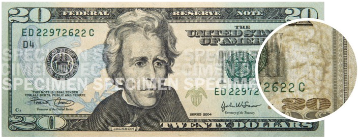
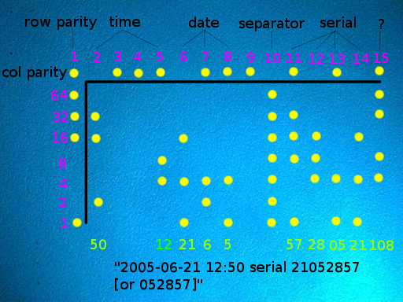

+++
slug = "spymarks"
title = "Spymarks, not Watermarks"
description = "Watermarks that spy on users are no mere watermarks"
tags = ["Privacy", "AI", "Technology"]
created_at = 2026-09-16
published_at = 2026-09-21
#updated_at = 2026-09-20
draft = false
nofollow_external_links = true
+++

There's a sneaky new evolution of the "watermark", let's call it &mdash; the spymark.

<div class="spymark-intro">

```embed
src = "spymark-title.ts"
title = "Spymark"
height = 410
fallback = "“Spymark”"
```

</div>

A **watermark** is a visible mark embedded in a physical or digital medium to verify authenticity or assert ownership.

A **spymark** is a hidden signal that makes your work traceable without your knowledge or consent.

## Spymarking is sneaking onto the internet

**[Google SynthID](https://deepmind.google/models/synthid/)** is a spymark that embeds secret hidden signals "imperceptible to humans" (Google's own words) into images, audio, text, and video. This signal can encode database identifiers that map to your identity. Your user records, full name, IP addresses, date of birth, physical addresses, political party affiliation, and more.

Google's [SynthID-Image paper](https://arxiv.org/abs/2510.09263) reports that its SynthID-O variant can encode a 136-bit payload in a 512x512-pixel image. That is enough room for a 64-bit database identifier, with 72 bits left for error correction.

SynthID was not the first spymark system designed, and it's hardly the only one under active development. [OpenAI](https://help.openai.com/en/articles/8912793-provenance-signals-content-credentials-synthid-in-openai-generated-content) and many other tech companies are developing these systems at scale. These companies claim spymarking can help identify AI-generated content, yet they've gone beyond simple watermarking and built in robust tracking mechanisms. Social media, content production tools, and smartphones may soon find themselves filled with spymarking algorithms that sneak these signals into everything you publish.

For example, images can be invisibly altered in their frequency domain to carry tracking information such as database IDs linked to users:

```embed
src = "image-watermarks.ts"
height = 650
fallback = "A smaller version of Mochi’s photo contains a real toy watermark: ID 173, encoded through subtle pixel changes. Compare the original and marked image, animate the amplified differences, and decode the ID from the PNG. The associated author and timestamp are fictional."
```


## Why give it a new name?

"Watermark" has become a catchall for historical marks of authenticity, banknote security features, copyright overlays, and hidden tracking signals in our media. That last usage obscures the privacy risk that some forms of modern "watermarks" have become.

Most people tire of the discourse on privacy. It's complex, repetitive, and seems irrelevant to the typical day-to-day routine of the average citizen. We can't keep explaining the technicalities behind statistical tracking tools each and every time we need to communicate these concepts to people and expect them to pay attention.

> "To speak the name is to control the thing." &mdash; Ursula K. Le Guin, [*The Rule of Names*](https://www.onelimited.org/ss-leguin-02)

With a simple change of terminology we can put the privacy concern up front, cementing this issue in the conversation forever:

- *Spy-* &mdash; clandestine surveillance, involuntary disclosure
- *-mark* &mdash; embedded signal

Now we get to disambiguate friendly watermarks from concerning new technology while leveraging the familiar etymology. It collapses a technical communication salient and gains us a lot of ground with just one new word. It's clear, coherent, and straight to the point.

No more wasting energy establishing the basic facts. The privacy concern is built into the word.

"Spymark" is a privacy *Rumpelstiltskin*.

## More spymark examples

Here are a few more forms of spymarks so you can better familiarize yourself.

Audio spymarks operate using principles similar to image spymarks, and they are typically inaudible. Some methods make minute changes to the audio waveform in the time domain; others modify features in the frequency domain, and some combine both approaches. These methods can encode data, including identifiers linked to personal information:

```embed
src = "audio-watermarks.ts"
title = "Audio watermark spectrograms"
height = 450
fallback = "Compare spectrograms of the same LJ Speech excerpt unwatermarked and with Timbre, AudioSeal, WavMark, FSVC, Patchwork, or Norm-Space. The authors’ original plots are linked below."
```

<small>Spectrograms from Wen et al. (2025), <a href="https://arxiv.org/abs/2503.19176">SoK: How Robust is Audio Watermarking in Generative AI models?</a> · <a href="https://sokaudiowm.github.io/">Original samples</a>. Plots retain the authors’ original scales.</small>

These schemes are engineered to be robust. They can often survive compression or re-encoding.

You can even encode personal information invisibly into text! [SynthID steers word choices](https://deepmind.google/blog/watermarking-ai-generated-text-and-video-with-synthid/) to create a detectable statistical pattern that can encode a tracking payload:

```embed
src = "text-watermarks.ts"
height = 650
fallback = "An illustrative encoding: eight word choices represent eight bits. The binary value 10101101 gives database ID 173, which can point to a record containing an author and timestamp. These are fictional examples, not a SynthID decoder."
```

## Watermarks are benign, spymarks are not

Watermarks remain easy for the user to spot and are typically not nefarious.

Sometimes watermarks deter counterfeiting:

<figure style="max-width: 708px; margin-inline: 0 auto;">
  
</figure>

Sometimes watermarks claim ownership:

<figure style="max-width: 481px; margin-inline: 0 auto;">
  <a href="https://commons.wikimedia.org/wiki/File:DorotheaGetty.webp"></a>
  <figcaption><small>Dorothea Lange, <cite>Migrant Mother</cite> (1936) &mdash; <a href="https://www.gettyimages.com/photos/migrant-mother-by-dorothea-lange">Getty sells</a> some <a href="https://en.wikipedia.org/wiki/Migrant_Mother">public domain images</a>.</small></figcaption>
</figure>

And sometimes they're just annoying:

<figure style="max-width: 500px; margin-inline: 0 auto;">
  <a href="https://en.wikipedia.org/wiki/Willy_Wonka_%26_the_Chocolate_Factory"></a>
</figure>

But these watermarks don't track you.

[Printer tracking dots](https://en.wikipedia.org/wiki/Printer_tracking_dots), on the other hand, are an early example of spymarks, dating back to the 1980s:

<figure style="max-width: 512px; margin-inline: 0 auto;">
  <a href="https://commons.wikimedia.org/wiki/File:Machine_Identification_Code_von_Druckern.png"></a>
  <figcaption><small>Image: <a href="https://commons.wikimedia.org/wiki/File:Machine_Identification_Code_von_Druckern.png">EFF — Robert Lee, Seth Schoen, Patrick Murphy, Joel Alwen, and Andrew “bunnie” Huang</a></small></figcaption>
</figure>

## Standardized, user-editable tags are not spymarks

We need to be clear that spymarks are a form of metadata you have limited knowledge of and control over, and that their purpose is entirely antagonistic to you.

Metadata such as the EXIF tags in photos and the ID3 tags in MP3 files are standardized, well-documented fields. While EXIF can expose sensitive data such as [GPS coordinates](https://exiftool.org/TagNames/GPS.html), these standardized fields can be inspected, edited, and removed from files you control.


```embed
src = "id3-hex.ts"
height = 520
fallback = "Inspect editable EXIF and ID3 metadata in two tabs. EXIF shows fictional camera-maker, model, and author tags in a JPEG metadata segment; ID3 shows an MP3’s title, artist, and album. Hover or tap the bytes for explanations. These samples contain metadata only."
```

You can strip standard metadata tags out of your files. Unfortunately, a spymark signal embedded in pixels, audio, or word choices is invisible to you and can remain in your files even after you edit them.

Furthermore, whereas tags are helpful for maintaining information such as song titles or a photo's exposure settings, spymarks encode user-tracking identifiers that are entirely opaque and useless to you. These signals can survive metadata removal and some edits, allowing marked copies to remain traceable as they circulate.

## Keeping our files free of spying

It's hard to imagine the future where we can't even trust our own files. And the sad thing is that this has already started.

Spymarks are certainly not great for whistleblowers or anyone who doesn't want to be persecuted for their words or affiliations. No matter where you stand on whatever issues, spymarks can be used against you and those you care about.

Imagine a future where every device is attested and every social media post carries an account-linked spymark. Where every file or post served to you for sharing has spymarks embedded within. Combined with account records and observations of where copies appear, these identifiers can help reconstruct how content spreads. In this world, it would be dangerously easy to hunt down anyone from a JPEG or a tweet. Or track the web of humans through which "dangerous ideas" flow.

That future lies halfway between now and *1984*. So let's stay off that timeline, shall we?

Call a spymark what it is. A *spy* tool used to spy on you and everyone you interact with.

&mdash; Brandon Thomas

## Usage

<link rel="stylesheet" href="dictionary.css">

<dl class="spymark-dictionary">
  <div>
    <dt><dfn>spy·mark</dfn> <span class="dict-pronunciation">/ˈspaɪmɑːrk/</span> <span class="dict-part">noun</span></dt>
    <dd>
      <p class="dict-forms">plural <strong>spymarks</strong></p>
      <p>A hidden signal embedded in media to trace its origin, tools, or distribution history without the user’s meaningful control.</p>
      <p class="dict-example">“The spymarks tied each copy to a different recipient.”</p>
    </dd>
  </div>
  <div>
    <dt><dfn>spymark</dfn> <span class="dict-part">verb, transitive</span></dt>
    <dd>
      <p class="dict-forms"><strong>spymarked</strong>; <strong>spymarking</strong>; <strong>spymarks</strong></p>
      <p>To embed a spymark in a file or piece of media.</p>
      <p class="dict-example">“The social network spymarks every uploaded image.”</p>
    </dd>
  </div>
  <div>
    <dt><dfn>spymarking</dfn> <span class="dict-part">noun</span></dt>
    <dd>
      <p>The practice of embedding spymarks.</p>
      <p class="dict-example">“The platform introduced spymarking without telling its users.”</p>
    </dd>
  </div>
  <div>
    <dt><dfn>spymarked</dfn> <span class="dict-part">adjective</span></dt>
    <dd>
      <p>Containing a spymark.</p>
      <p class="dict-example">“Removing the file’s metadata still left the image spymarked.”</p>
    </dd>
  </div>
</dl>
